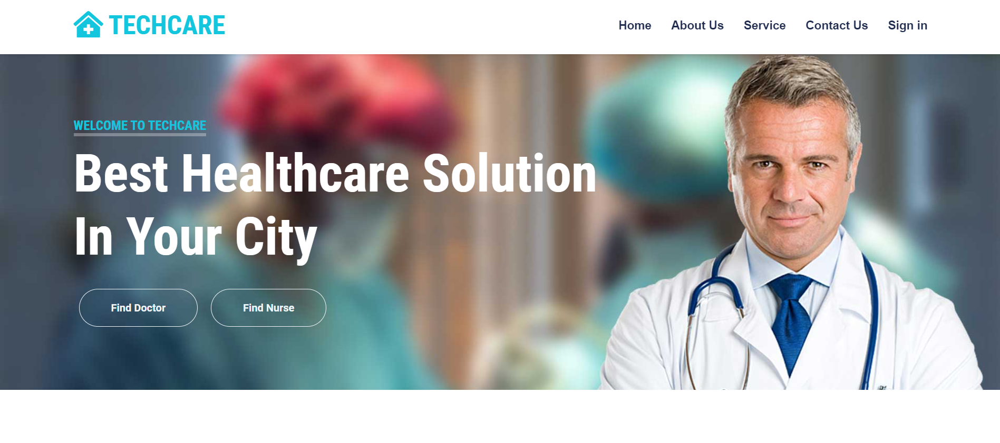
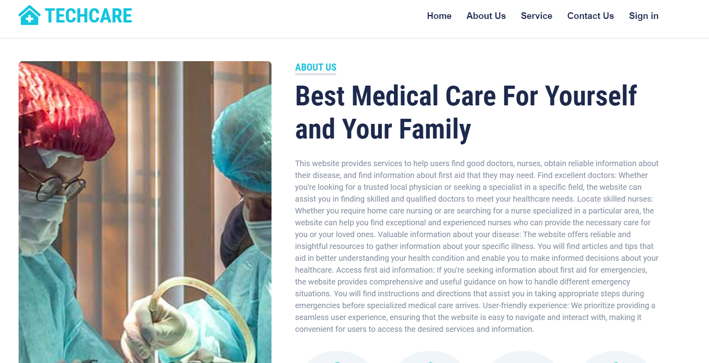

# TechCare
# Introduction:
A comprehensive online project dedicated to improving patient care by offering a wide range of health services, including doctor and nurse finding, disease information, first aid guidance, and advanced skin disease prediction, all conveniently accessible through a single platform.
# Technologies Used:
- Python
- Django framework
- Django Rest framework
- PostgreSQL
- Git and GitHub
- Visual Studio Code
- HTML5
- CSS3
- JavaScript

# Installation:

Follow these steps to set up and run the project locally on your development environment:

 Clone the repository to your local machine:

   ```bash
   git clone https://github.com/yourusername/your-project.git

   cd your-project

   python -m venv venv

   pip install -r requirements.txt

   python manage.py migrate

   python manage.py createsuperuser


   python manage.py runserver
```


# Usage

This project provides a range of valuable functions:

- Discover Your Ideal Doctor Online: Find your perfect doctor online for a personalized healthcare journey with confidence and ease.

- Connect with Your Ideal Nurse Online: Seamlessly connect with your preferred nurse online, ensuring a personalized and confident healthcare experience.

- Empower Yourself with Comprehensive Disease Information: Access extensive disease information to confidently and knowledgeably manage your health.

- Gain Vital First Aid Knowledge Online: Acquire essential first aid knowledge online, enabling you to provide immediate assistance with confidence.

- Identify Skin Diseases Easily: Quickly determine the type of skin disease you might have, facilitating informed decisions about your health.

Explore these features to make the most of this project and enhance your healthcare experience.

# Screenshots
Home Page:


About Us Page:



